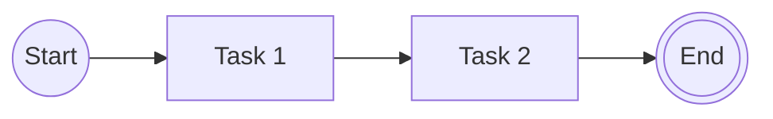
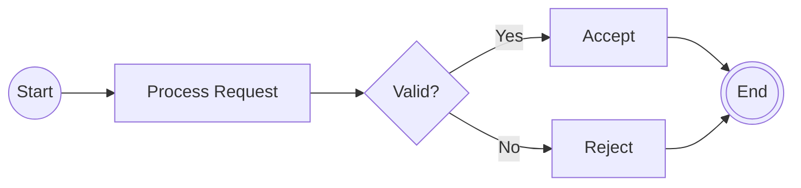
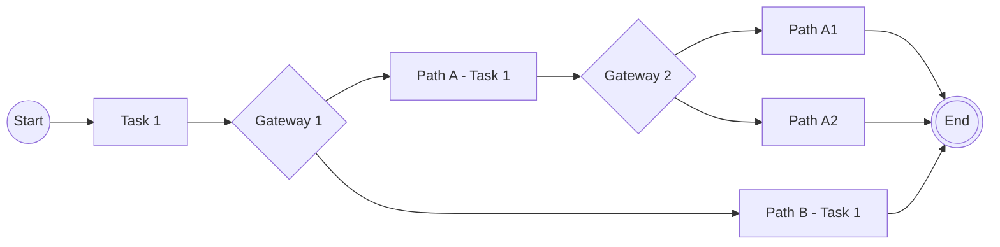
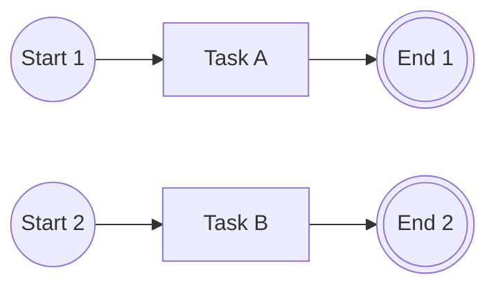
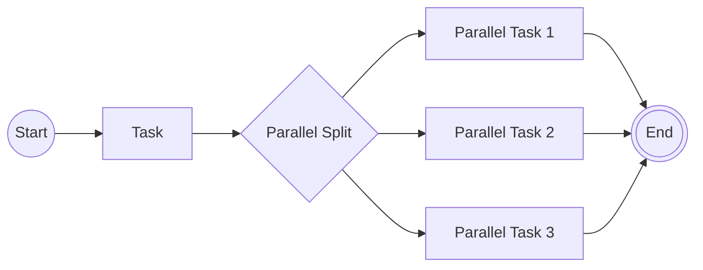

# BPMN Auto-Layout Examples

This document demonstrates how the BPMN auto-layout algorithm handles various diagram patterns.

## Algorithm Overview

The BPMN auto-layout uses a flow-based algorithm that:
1. Starts from nodes with no incoming connections (start events)
2. Proceeds left-to-right for sequential flows
3. At gateways (nodes with multiple outgoing connections):
   - Calculates branch length for each path (total node count)
   - Longer branch continues on current row
   - Shorter branches move to next row down
   - **All branches start at the same X position** (right after the gateway that spawned them)
4. Nested branches follow the same pattern (always go down)
5. Shapes are center-aligned vertically within their rows

## Example 1: Simple Linear Flow



**Expected Layout:**
- All nodes on same row (y = 0)
- Horizontal spacing: 200px between nodes
- Left-to-right: Start → Task 1 → Task 2 → End

## Example 2: Single Gateway with Two Branches



**Expected Layout:**
```
Row 0: Start → Process Request → Gateway → Accept → End
                                     ↓         ↑
Row 1:                             Reject ────┘
```

**Key Points:**
- Gateway on row 0 (centered with continuing branch)
- "Accept" path (longer/continues) on row 0
- "Reject" path (shorter) on row 1
- **"Reject" starts at the same X position as "Accept"** (right after Gateway)
- Both branches converge at End on row 0

## Example 3: Nested Branches



**Expected Layout:**
```
Row 0: Start → Task 1 → GW1 → Path A Task 1 → GW2 → Path A1 → End
                          ↓                      ↓       ↑
Row 1:                Path B Task 1 ────────────┴───────┘
                                                  ↓
Row 2:                                        Path A2 ────┘
```

**Key Points:**
- Gateway 1: Path A (longer) continues row 0, Path B goes to row 1
- **Path B starts at same X as Path A** (right after GW1)
- Gateway 2: Path A1 (longer) continues row 0, Path A2 goes to row 2
- **Path A2 starts at same X as Path A1** (right after GW2)
- All paths converge at End

## Example 4: Multiple Start Events



**Expected Layout:**
```
Row 0: Start 1 → Task A → End 1
Row 1: Start 2 → Task B → End 2
```

- All start events begin at x = 0
- Each start event on different row
- Independent flows don't interfere

## Example 5: Parallel Gateway (Treated Same as Exclusive)



**Expected Layout:**
```
Row 0: Start → Task → Gateway → Parallel Task 1 → End
                         ↓
Row 1:               Parallel Task 2 ─────────┘
                         ↓
Row 2:               Parallel Task 3 ─────────┘
```

- Longest branch (Task 1) continues on row 0
- Each additional branch goes to next row down
- All converge at End on row 0

## Spacing Configuration

Default spacing values (from MermaidImportOptions):
- **Horizontal spacing**: 200px between shapes on same row
- **Vertical spacing**: 150px between rows

## Shape Dimensions

Used for layout calculations and vertical centering:
- **BPMN Event**: 40x40px (circle)
- **BPMN Gateway**: 60x60px (diamond)
- **BPMN Task**: 120x80px (rectangle)

## Testing in the Application

To test the auto-layout with these examples:

1. Open the Design Studio
2. Create a new BPMN diagram
3. Use the "Generate from Mermaid" feature (if available)
4. Paste any of the example Mermaid syntax above
5. Observe the generated layout

The shapes should be automatically positioned according to the flow-based layout algorithm, with proper alignment and spacing.
